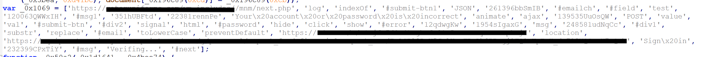
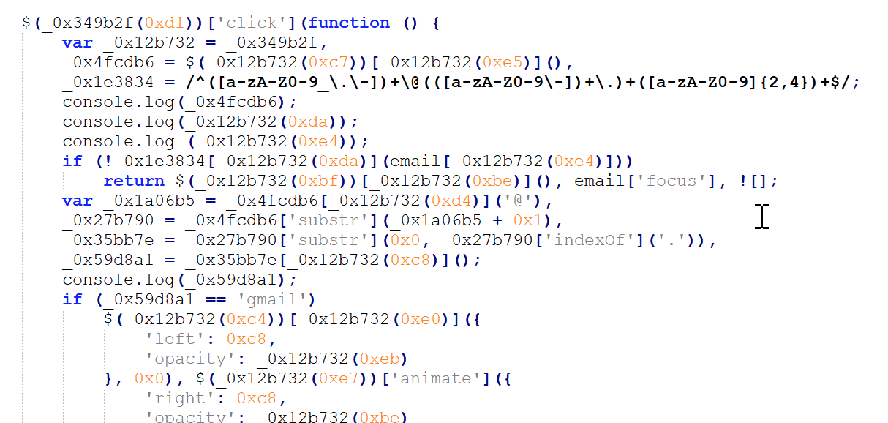
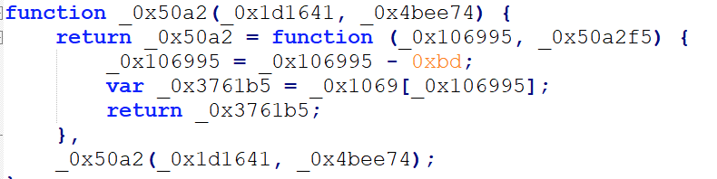
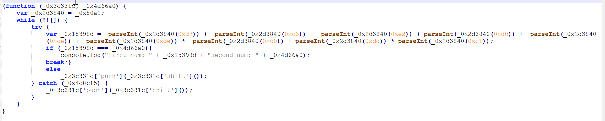
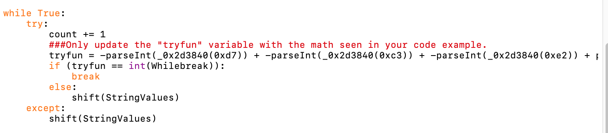
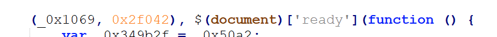
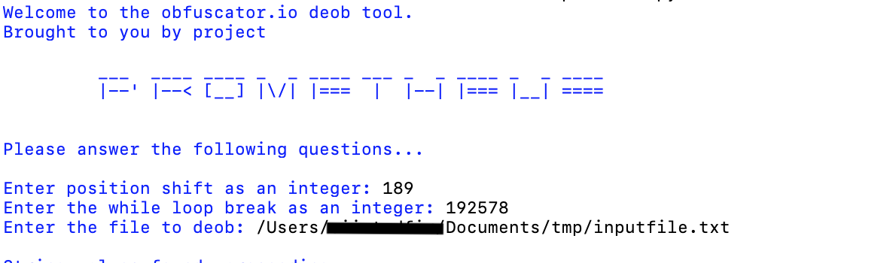
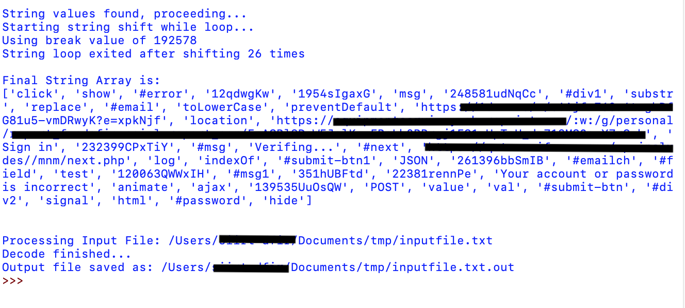
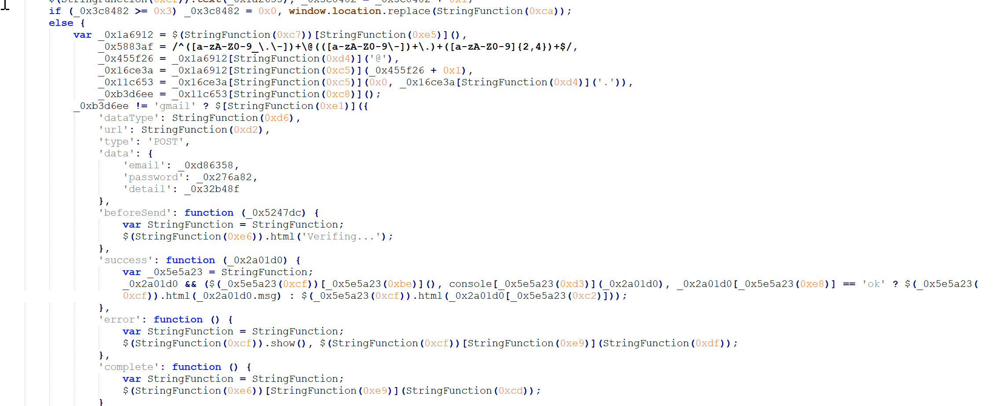
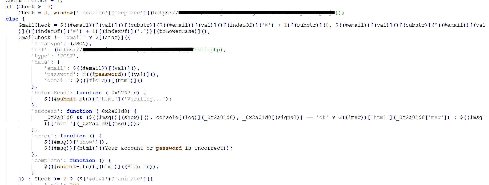

This tool is specifically designed to handle output from https://obfuscator.io/.  While full automation could be possible, that seems to be the downfall of other similar tools.  To help try and avoid the same issues, we are going to do this in a semi-automated fashion. 
 
Let's step through how this obfuscation site works and what this code does.
 
From what I can tell, the JS obfuscator site has many potential tweaks it can make to your code, however at its core, it seems to be based on hiding the strings in a string array.  This could either be assigned to a variable or inside a function.  Also, most of the options on that site seem to require the strings array, so that's the focus of this tool.
 
Let's look at the JS and walk through how each part of the function works.
 
Here is the string array, normal as you would expect.

 
 
This is where the string array is actually called in the functions that reference a hex value (ie: 0xc4)

 
Ok great, so let's just print out that string array with its position with a quick for loop in Python or something and do some of these by hand.
However, it's referencing numbers outside of the array.
 
This is due to the string position shift happening here:
 

 
This function takes the position offset and subtracts a value from it.  So for this example it takes 0xbd or decimal 189 away.
 
So lets say it tries to call the string array with 0xc4, but first subtracts 0xbd.
 
We have the following in decimal: 196 - 189 = 7.  So this is really trying to return the string at position 7.
 
But wait, the returned string doesn't make any sense for the block of code I'm looking at.
 
Thats because of this while true loop:
 

 
This loop runs before anything else and does the following.  It performs parseint on certain parts of the string, looking for a specific and valid int value.  This could only happen in one certain order, so if it doesn't match, it performs a push, followed by a shift, which essentially takes the string on the front and moves it to the end of the array.  That loop will continue to do that until it's in the right order.
 
Once that happens, it is just as easy as performing the array lookup we talked about earlier.  However, some of these files can be large and that would take some time, so the script created here will do that for you.  Lastly, there is some cleanup done by the script so that it removes the calling function for the string array as well as some of the misdirection done during obfuscation.  There is a lot of var function = function, which no longer serves a purpose after deob.
 
Ok, let's take a look at the script and see what is needed for a successful deob.
 
We need to know four key values, some of which need to be placed into the script.
 
1. We need to paste the string array into the script.
2. We need to paste in the while loop into the script.
3. We need to know the string position shift value.
4. We need to know the while loop break value.
 
 
 
<!-- -->
 
 
1. This is straightforward and just an exact replacement of the contents of the StringValues variable.
 
2.
This (from the raw code)

 
Becomes this (in our python script)

 
Ok, that's not bad, you really only need to paste in the main math portion of that function.  The variable is named "tryfun".
 
3.
We just need the hex value being subtracted here:

 
4.
This one is a little harder to spot due to the way the code is written.  Look at what happens right after the while loop.  You should have two values on their own like this:
 

 
The hex number on the right (0x2F042) is actually 192578 in decimal.  That's when that while loop will break.
 
 
Let's use the actual code now.
 

 
So we already plugged in our while loop math and the string array directly into the code.  Here we are answering the questions presented.
 
Just two integers are needed, one for the position shift and the other for when the while loop breaks.
 
The last item needed is the input file.  In this case, its what you want to deob.  I would suggest you be a little selective and use everything after the while loop.
 

 
That's it.  The script will output the number of times it had to shift along with the final string array.
 
Lastly, it will output a new file, appending .out onto whatever your input was.  If you want to clean that up and read it even easier I would suggest pasting it into notepad ++ and save it as a JS file.  It will highlight syntax and then you can clean it up a little more after that if you want.
 

Ok, but how much did all this work actually help.  To answer that, here is a side by side of the same portion of code before and after running this tool (plus a few minutes of cleanup).

Before            |  After
:-------------------------:|:-------------------------:
  |  
